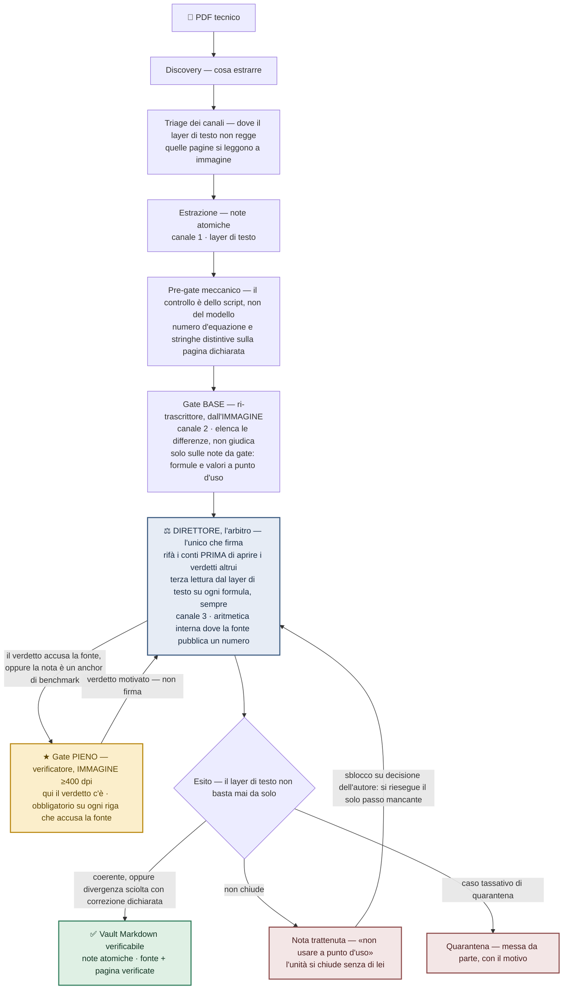

# florilegium

> Una pipeline agentica multi-fase che trasforma raccolte di PDF tecnici in una
> knowledge base Markdown **verificabile** — con gate di qualità indipendenti e
> robustezza verso OCR degradati.

**Filosofia:** *Knowledge quality over token efficiency* (la qualità della conoscenza
prima dell'efficienza sui token).

🇬🇧 *This page is also available in [English](README.md).*

> **Stato del progetto — M1 (“la Storia”).** Questo repository pubblica per ora la
> **metodologia** e il registro delle decisioni dietro la pipeline. Il motore
> eseguibile, i prompt generalizzati e i benchmark riproducibili arrivano nelle
> milestone successive (vedi [Roadmap](#roadmap)). Nulla di quanto qui presente
> dipende da materiale privato o protetto da copyright.

---

## Il problema

Trasformare uno scaffale di PDF tecnici — articoli, normative, libri — in una
knowledge base pulita e ricercabile sembra un problema risolto. Non lo è.

- **L'OCR mente, e mente peggio proprio dove conta.** Il corpo del testo sopravvive
  abbastanza bene. **Le formule no** — e queste sono le corruzioni che un layer di
  testo nasconde meglio (esempi illustrativi della classe di guasto; gli episodi
  misurati sono nel [diario](journal/README.it.md)):
    - un **esponente** letto male: la pendenza di una curva di fatica S–N letta `Δσ³`
      invece di `Δσ⁵`, e la vita prevista sbaglia di ordini di grandezza;
    - un **pedice** scambiato: una resistenza caratteristica `f_ck` letta come il
      valore di progetto `f_cd`, inglobando o togliendo silenziosamente un fattore di
      sicurezza;
    - un **simbolo** raddoppiato: un periodo proprio `T = 2π·√(m/k)` dove `2π` diventa
      `2π²`.

  Ognuna trasforma un'equazione corretta in una plausibile e sbagliata — e l'errore è
  *silenzioso*: l'output sembra pulito, quindi nessuno controlla.
- **La struttura si perde.** Sezioni, didascalie, confini delle tabelle e il legame
  tra una formula e il paragrafo che ne definisce i simboli si sciolgono in un muro
  di testo piatto.
- **L'estrazione è incompleta e duplicata.** Lo stesso risultato viene catturato due
  volte con parole diverse, mentre un'ipotesi chiave tre righe sopra l'equazione non
  viene catturata affatto.

E queste formule non si leggono una volta e si dimenticano — si **usano**. Ogni nota è
fatta per alimentare il codice di calcolo: un esponente sbagliato o un pedice scambiato
non è un problema cosmetico, è un **risultato sbagliato a valle**, prodotto da uno script
che non mette mai in dubbio il numero che gli è stato passato.

Un singolo prompt su un modello grande, applicato al testo OCR, produce qualcosa che
si *legge* bene. Leggersi bene non è essere corretti — e sulle formule un prompt che
vede solo testo non ha alcun modo di accorgersi che gli è stata passata un'equazione
già corrotta.

---

## Perché è diverso

**La feature-eroe: le formule si verificano dall'*immagine* della pagina, non dal
testo OCR.**

Leggere una pagina come immagine non è una novità — Nougat, Mathpix, marker e MinerU
lo fanno già, spesso molto bene. Nessuno dei quattro, però, produce **una seconda
lettura indipendente della formula**: i segnali di qualità che offrono sono segnali
**su se stessi** (la confidenza per riga di Mathpix, il rilevamento della propria
degenerazione in Nougat), e l'unica seconda passata esistente — la modalità LLM di
marker — **corregge l'output del primo passaggio**, quindi vi è ancorata.

Nemmeno la verifica per confronto è una novità: far leggere la stessa immagine a più
modelli e trattare il disaccordo come segnale d'errore è già una linea di ricerca
attiva ([Consensus Entropy](https://arxiv.org/abs/2504.11101), 2025), accanto al
modello-giudice e alla self-consistency. florilegium non moltiplica le letture della
**stessa** sorgente: le fa venire da **canali diversi** — il layer di testo, l'immagine
e, dove la fonte pubblica un numero, l'**aritmetica interna**, che non è una lettura
affatto. E aggiunge due vincoli che in quei lavori non sono in questione:
**indipendenza informativa** (a chi rilegge non viene mai detta la risposta attesa — il
vincolo che la modalità LLM di marker viola per costruzione) e **terzietà** (chi legge
non è chi giudica). Non è una metrica: è una **dottrina di processo**, con gate a due
livelli, innesti di escalation dichiarati e un arbitro che firma. Le formule sono
proprio il punto in cui gli errori silenziosi sono più probabili e più costosi, e un
errore è invisibile a qualunque processo che possieda una sola lettura. florilegium
chiude questo punto cieco:

1. **Visualizza, non fidarti.** La pagina PDF rilevante viene resa come **immagine** ad
   alta risoluzione.
2. **Ri-trascrivi in modo indipendente.** Una fase separata rilegge la formula
   *dall'immagine*, senza il ragionamento di chi l'ha estratta e senza che le venga
   detto cosa aspettarsi: i bersagli le sono indicati per **posizione e numero**, mai
   per valore. La sua trascrizione si chiude **prima** che le sia consentito guardare la
   prima — così non può ereditarne gli errori.
3. **Confronta in modo incrociato.** Le due letture indipendenti vengono messe a
   confronto. L'accordo è evidenza; il disaccordo non decide niente da solo: apre
   il **giudizio dell'arbitro**, che dispone di un canale che nessuna delle due
   letture ha usato.
4. **Interroga un canale che non sta leggendo affatto.** Dove la fonte pubblica un valore
   che la formula deve riprodurre — un numero svolto, un caso limite, il bilancio
   dimensionale — florilegium rifà quel conto. Chiude la questione senza guardare nessuna
   delle due letture, e sbaglia in un modo in cui nessuna delle due letture può sbagliare.
   Due letture che concordano possono essere semplicemente lo stesso errore due volte.

Non è un modello che “ricontrolla se stesso”. È **verifica di terza parte**: la funzione
che rilegge una formula **non ha interesse nella prima lettura** e **non le viene mai
detta la risposta attesa** — né nelle istruzioni, né attraverso un campo che la faccia
rientrare di lato. E chi rilegge non è chi giudica: le differenze che riporta le decide un
terzo, che dispone di un canale che chi ha riletto non ha usato. Così un agente non-terzo
non può far passare il proprio errore come giusto. Due letture, da due sorgenti di verità diverse (testo vs.
immagine), provenienti da funzioni completamente indipendenti l'una dall'altra. Un singolo
prompt non può farlo — ha una sola lettura e nessuna seconda sorgente disinteressata
che la contraddica.

E taglia in due direzioni. Una lettura indipendente dall'immagine non cattura solo le
corruzioni che il layer di testo ha mancato — **smonta anche i falsi allarmi**: i casi
in cui un controllo solo-testo “correggerebbe” una formula che nella fonte era in
realtà giusta. È la resa del rigo conteso ad alta risoluzione a distinguere un vero
errore di fonte da un artefatto dell'OCR.

Nell'insieme, è la **quality assurance** di florilegium — non una casella spuntata alla
fine, ma gate a due livelli e verifica di terza parte intessuti nella pipeline. Due
altri principi la completano, documentati nei registri di architettura
([ADR-0001](architecture/decisions/0001-formula-verification-from-image.it.md),
[ADR-0002](architecture/decisions/0002-verdict-as-source-of-error.it.md)):

- **Gate a due livelli, più un arbitro.** Il gate base gira sulle note che portano
  formule o valori; il gate pieno, costoso, scatta solo quando un verdetto **accusa la
  fonte** — oppure la nota è un **anchor di benchmark**. Le discrepanze non salgono al
  gate costoso: le scioglie l'**arbitro**, l'unico che firma. Qualità dove serve, costo
  dove non serve.
- **Il verdetto obbligatorio è esso stesso una sorgente di errore.** Obbligare una
  funzione a emettere un verdetto pass/fail su ogni elemento fabbrica falsa sicurezza.
  florilegium tratta il verdetto come evidenza da pesare, non come una verità assoluta —
  un'intuizione che ha plasmato l'intero disegno dei gate.

Ognuna di queste regole è stata pagata con un fallimento preciso. Il
**[journal](journal/README.it.md)** ne registra cinque.

---

## Architettura



Ogni fase rappresenta una funzione con un unico compito e requisiti di inizio e fine
ben definiti. Le funzioni non condividono informazioni nascoste; una fase successiva
non accede mai al processo logico di quella precedente, ma riceve solo il suo output.
È questa separazione — un verificatore che è una vera **terza parte**, senza interesse
nell'output che controlla — a rendere la verifica *indipendente* anziché
auto-confermante.

In dettaglio: [panoramica dell'architettura](architecture/overview.it.md) ·
[le funzioni della pipeline](architecture/roles.it.md) ·
[i gate di qualità](architecture/quality-gates.it.md).

---

## Come funziona (in breve)

```
PDF → discovery → triage dei canali → estrazione → pre-gate meccanico
    → gate base → arbitro (→ gate pieno ★) → vault verificabile | trattenuta | quarantena
```

- **Discovery** decide cosa vale la pena estrarre e in che ordine.
- **Triage dei canali** guarda, prima di estrarre, dove il layer di testo non regge:
  quelle pagine si leggeranno a immagine.
- **Estrazione** produce note Markdown atomiche dal layer di testo.
- **Pre-gate meccanico**: uno script controlla che la pagina dichiarata contenga davvero
  il numero d'equazione e le stringhe distintive. Chi lo lancia è una funzione come le
  altre, ma il controllo è dello script: nessun giudizio di modello, e il costo è solo
  quello di lanciare lo script.
- **Gate e arbitro** eseguono il controllo descritto sopra: il gate base elenca le
  differenze, l'arbitro le scioglie e firma, e la verifica dall'immagine a ≥400 dpi è il
  percorso di escalation quando si accusa la fonte.
- **L'esito si decide nota per nota.** Ciò che chiude viene firmato. Ciò che non chiude
  resta **trattenuto** — marcato «non usare a punto d'uso», e l'unità si chiude senza di
  lui; una nota trattenuta si sblocca solo su decisione esplicita, che riesegue il **solo
  passo mancante**. Ciò che ricade in uno dei casi tassativi di quarantena viene messo da
  parte, con il motivo. Le correzioni esistono, ma sono sempre **dichiarate**, mai
  silenziose.
- Il risultato è un vault di **note atomiche**, ognuna con un frontmatter che registra
  la fonte e la pagina verificate — così ogni affermazione è tracciabile fino al PDF
  da cui proviene. Le note sono **Markdown puro**, quindi si aprono in qualsiasi editor
  e restano tue; i `[[wikilink]]` le trasformano in un **grafo di conoscenza
  navigabile** in [Obsidian](https://obsidian.md) — scelto perché è del tutto **locale
  e offline**, nessun servizio in cloud richiesto.

---

## Stato & implementazione

- **Milestone attuale: M1 — la Storia.** Metodologia, architettura e registri delle
  decisioni. Nessun motore eseguibile nel repo *per ora* (è M2, di proposito — vedi
  sotto).
- **Implementazione di riferimento:** Claude Code su Linux — su un **portatile
  dual-core del 2015**. È una scelta: qui il valore è il *metodo*, non l'hardware
  costoso. Dichiarato apertamente, non nascosto.
- **Provider-agnostico per disegno.** Il metodo non è legato a un singolo fornitore di
  IA. Le funzioni, i gate e la tecnica di verifica-da-immagine sono descritti in modo da
  poter essere ricostruiti su un altro modello o fornitore — Claude è l'implementazione
  di oggi, non un requisito.

Rilasciamo **a livelli**, e ogni livello è completo in sé:

<a name="roadmap"></a>

| Milestone | Cosa aggiunge | Stato |
|---|---|---|
| **M1 — la Storia** | README, architettura, registri delle decisioni (ADR), un esempio completo e uno script breve che lo automatizza | **rilasciata — questo repository** |
| **M2 — il Motore & i Gate** | Orchestratore, batch e session management + i prompt di funzione generalizzati e la configurazione operativa dei gate | pianificata |
| **M4 — Benchmark & v1.0** | Singolo-prompt vs. catena, robustezza OCR, costo/token, con dati riproducibili + CI | pianificata |

La M3 non c'è: le vecchie M2 e M3 sono state **fuse** — un orchestratore senza i prompt
di funzione è un'impalcatura, non una pipeline, quindi escono insieme. La M4 mantiene il
suo numero, così i registri delle decisioni che la citano restano validi. Dettaglio
completo in [ROADMAP.it.md](ROADMAP.it.md).

Perché il codice viene *dopo* la storia: qui il valore è il **metodo e le decisioni**,
non una cartella di script. Pubblicare prima il ragionamento è una scelta deliberata.

**E il metodo si adotta a pezzi, già oggi, senza nessun motore.** Due di queste regole non
costano nulla da applicare a mano e valgono già da sole: rendere la pagina a **≥400 dpi e
rileggere la formula dall'immagine prima di accusare la fonte di un refuso**, e **non dire
mai a chi rilegge la fonte quale risposta ci si aspetta**. Non è un sostituto di M2 — è la
parte di florilegium che non ha bisogno di codice.

---

## Installazione & esempio

Non c'è ancora niente da installare: il motore eseguibile arriva con **M2**. Quello che
esiste oggi è l'**esempio completo**, ed è deliberatamente riproducibile **a mano** — due
comandi di `poppler-utils`, nessuna chiave API, nessun modello, nessun account.

→ **[examples/01 — una formula che il layer di testo ha rotto in silenzio](examples/01/README.it.md)**

Gira su un input a **licenza aperta** (un articolo di rivista CC-BY 4.0, scaricabile dal
suo DOI) e segue una singola equazione attraverso i tre canali: il layer di testo perde in
silenzio entrambi i segni meno, l'immagine a 400 dpi li mostra, e l'aritmetica interna alla
fonte chiude la questione senza guardare nessuna delle due letture.

> Nessun PDF sorgente è, o sarà, committato in questo repository. Gli esempi usano solo
> materiale a licenza aperta.

---

## FAQ

**In cosa è diverso da Nougat, Mathpix, marker o MinerU?**
Quegli strumenti risolvono l'*estrazione*: trasformare una pagina PDF — di solito
passando dall'immagine — in testo o LaTeX, e alcuni lo fanno molto bene. florilegium
non compete sull'estrazione; in linea di principio può appoggiarsi a ciascuno di
loro. Quello che aggiunge è la verifica **in contraddittorio**, e la differenza sta in
che cosa ciascuno chiama «verifica»:

- **Mathpix** restituisce una confidenza e scarta le righe sotto soglia: è la stima che
  il modello dà **di se stesso**, su una lettura sola.
- **Nougat** rileva quando degenera nella ripetizione: intercetta il guasto
  catastrofico, non l'errore plausibile.
- **marker**, in modalità LLM, fa una seconda passata che **corregge il proprio
  output**: l'LLM vede la prima lettura, quindi ne eredita gli errori invece di
  scoprirli.
- **MinerU** usa un secondo modello per verificare il **testo**; le formule vengono
  sostituite dall'output di un modello specializzato, non verificate.

In florilegium la seconda lettura è fatta da una funzione che non ha mai visto la prima
e a cui non viene detto cosa aspettarsi, seguita da un confronto incrociato e, in caso
di disaccordo, dal giudizio di un arbitro su un canale che nessuna delle due letture ha
usato. Un estrattore ti consegna una risposta; florilegium ti dice se fidarti.

**E rispetto ai lavori che confrontano più letture (Consensus Entropy, modello-giudice)?**
Quella linea di ricerca fa leggere la **stessa immagine** a più modelli e usa il
disaccordo come segnale d'errore: è un buon rilevatore, ed è precedente a questo
progetto. Le differenze sono tre. Le nostre letture vengono da **canali diversi**, non
da N copie dello stesso canale — e il terzo, l'aritmetica interna alla fonte, non è una
lettura ma un conto che deve tornare. L'indipendenza è **imposta**, non sperata: a chi
rilegge non viene consegnata la risposta attesa. E l'esito non è un punteggio, è un
**percorso**: escalation dichiarata, nota trattenuta o quarantena, e una firma che
risponde.

**Perché più agenti invece di un singolo prompt grande?**
Perché un singolo prompt ha una sola lettura della pagina. La verifica indipendente ha
bisogno di una *seconda* lettura da una sorgente *diversa* (l'immagine), prodotta da una
funzione che non vede la prima. Un prompt solo, strutturalmente, non può catturare un
errore di formula silenzioso; una catena sì.

**Perché non usare ovunque un modello piccolo ed economico?**
Alcune fasi lo tollerano; le fasi di verifica no. Tutto il senso è catturare gli
errori che le fasi più economiche mancano. Il gate a due livelli esiste proprio
perché il lavoro costoso giri solo dove ripaga il suo costo.

**Non è più token / più costoso di un'estrazione one-shot?**
Sì — ed è il compromesso da cui il progetto prende il nome. *Knowledge quality over
token efficiency.* Se una formula silenziosamente sbagliata nella tua knowledge base è
accettabile, non ti serve florilegium. Se non lo è, i passaggi in più sono il prezzo
per catturarla.

**Perché Obsidian — e ci resto incatenato?**
Nessun lock-in. L'output sono file Markdown puri sul tuo disco. Obsidian è il lettore
consigliato perché rende i `[[wikilink]]` come grafo di conoscenza **locale e offline**
— niente esce dalla tua macchina, nessun servizio online tipo un grafo ospitato — ma
gli stessi identici file funzionano in qualsiasi editor Markdown, in `grep`, o nello
strumento che preferisci.

---

## Limiti

Dichiarati in cima, perché l'onestà sui limiti è parte del metodo:

- **Riduce gli errori di formula silenziosi; non li elimina — per disegno.** Quando le
  due letture indipendenti divergono, florilegium alza una bandiera: la scioglie
  l'arbitro con un terzo canale, e ciò che resta irrisolto finisce in **quarantena**,
  sotto gli occhi di un umano. Non sceglie mai di nascosto un vincitore, perché un
  disaccordo mostrato è sicuro e una “correzione” sbagliata nascosta no. È una scelta
  deliberata, non un difetto.
- **L'indipendenza è informativa, non statistica.** Due letture indipendenti non
  condividono stato né risposta attesa, ma possono condividere **modi di guasto**: sono
  affidate a modelli della stessa famiglia, e davanti a un glifo ambiguo l'errore fra due
  letture può risultare **correlato** — è successo, in due documenti su due. È una delle
  ragioni per cui il gate non si ferma a due canali: il terzo non legge affatto, e dove la
  fonte pubblica un numero che la formula deve riprodurre, o il conto chiude o non chiude.
- **L'evidenza pubblicata viene da articoli di rivista.** Le cinque voci di diario e i dati
  direzionali degli ADR nascono tutti da articoli scientifici; fra i documenti passati in
  catena c'è anche un capitolo di libro, ma **nessuna normativa**. Il problema dichiarato
  in apertura di questo README parla di articoli, normative e libri: l'estensione a
  normative e testi è un **obiettivo del progetto**, non un risultato osservato.
- **“Provider-agnostico” è un impegno di disegno, non ancora un adattatore finito.** Il
  metodo è descritto per essere portabile tra modelli; oggi gira su Claude Code.
  Collegare un altro fornitore richiede ancora lavoro. Due vincoli sono impliciti e vanno
  detti: le funzioni che leggono dall'immagine richiedono modelli **multimodali** — il
  metodo non è portabile su un fornitore solo-testo; e l'orchestrazione di riferimento
  assume **sessioni con contesto limitato**, dato che le regole di arresto sono scritte in
  percentuale di contesto occupato.
- **I benchmark pubblici arrivano con M4.** Fino ad allora questo README descrive un
  **metodo** ed evita deliberatamente di citare numeri non ancora riproducibili da
  questo repository. È onestà, non debolezza.

---

## Licenza

Il repository ha **due licenze**, per perimetri distinti: il **codice** (script,
configurazioni, futuro motore) sta sotto Apache-2.0; **tutto il resto** — README,
`architecture/`, ADR, `journal/`, `examples/`, diagrammi — sta sotto CC-BY-4.0. Testi
integrali: [`LICENSE`](LICENSE) e [`LICENSES/CC-BY-4.0.txt`](LICENSES/CC-BY-4.0.txt).

- **Codice:** [Apache-2.0](LICENSE) — permissiva, con clausola brevetti esplicita.
- **Documentazione, diagrammi e registri delle decisioni:**
  [CC-BY-4.0](LICENSES/CC-BY-4.0.txt) — liberamente riusabili **con attribuzione**
  ([sintesi](https://creativecommons.org/licenses/by/4.0/deed.it)).

Copyright © 2026 Raffaele Santoro.

Entrambe le licenze richiedono l'attribuzione; l'attribuzione è il meccanismo con cui
questo lavoro viene citato.

## Come citare

> Santoro, R. (2026). *florilegium: a multi-stage agentic pipeline for verifiable
> PDF-to-Markdown knowledge extraction.* https://github.com/torus24/florilegium

---

*florilegium — “raccolta di estratti scelti”. Che è esattamente ciò che è l'output.*
