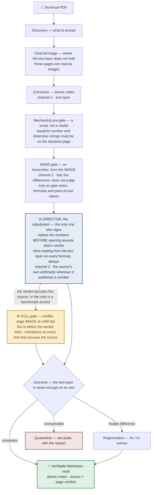

# florilegium

> A multi-stage agentic pipeline that turns collections of technical PDFs into a
> **verifiable** Markdown knowledge base — with independent quality gates and
> robustness against degraded OCR.

**Philosophy:** *Knowledge quality over token efficiency.*

🇮🇹 *Questa pagina è disponibile anche in [italiano](README.it.md).*

> **Project status — M1 (“the Story”).** This repository currently publishes the
> **methodology** and the design record behind the pipeline. The runnable engine,
> the generalized prompts and the reproducible benchmarks land in later milestones
> (see [Roadmap](#roadmap)). Nothing here depends on private or copyrighted material.

---

## The problem

Turning a shelf of technical PDFs — papers, standards, textbooks — into a clean,
searchable knowledge base looks like a solved problem. It is not.

- **OCR lies, and it lies worst exactly where it matters.** Body text survives
  reasonably well. **Formulas do not** — and these are the corruptions a text layer
  hides best:
    - an **exponent** misread: the slope of a fatigue S–N curve read as `Δσ³` instead
      of `Δσ⁵`, and the predicted life is off by orders of magnitude;
    - a **subscript** swapped: a characteristic strength `f_ck` read as the design
      value `f_cd`, silently folding a safety factor in or out;
    - a **symbol** doubled: a natural period `T = 2π·√(m/k)` where `2π` becomes `2π²`.

  Each turns a correct equation into a plausible, wrong one — and the error is
  *silent*: the output looks clean, so nobody checks.
- **Structure is lost.** Sections, figure captions, table boundaries and the link
  between a formula and the paragraph that defines its symbols dissolve into a flat
  wall of text.
- **Extraction is incomplete and duplicated.** The same result gets captured twice
  under different wording, while a key assumption three lines above the equation is
  never captured at all.

And these formulas are not read once and forgotten — they get **used**. Every note is
meant to feed calculation code: a wrong exponent or a swapped subscript is not a
cosmetic typo, it is a **wrong result downstream**, produced by a script that never
questions the number it was handed.

A single large-model prompt over the OCR text produces something that *reads* well.
Reading well is not the same as being correct — and for formulas, a text-only prompt
has no way to notice it was handed a corrupted equation in the first place.

---

## Why it is different

**The hero feature: formulas are verified from the *image* of the page, not from the
OCR text.**

Every tool in this space trusts the text layer. Formulas are precisely where that
text layer is least trustworthy, and the failures are invisible to any process that
only ever sees text. florilegium closes that blind spot:

1. **Render, don't trust.** The relevant PDF page is rendered as a high-resolution
   **image**.
2. **Re-transcribe independently.** A separate stage re-reads the formula *from the
   image*, without the reasoning of whoever extracted it and without being told what to
   expect: its targets are pointed at by **position and quantity**, never by value. Its
   transcription is closed **before** it is allowed to look at the first one — so it
   cannot inherit its mistakes.
3. **Cross-check.** The two independent readings are compared. Agreement is evidence;
   disagreement settles nothing on its own: it opens the **adjudication**, which holds a
   channel neither reading used.
4. **Ask a channel that isn't reading at all.** Where the source publishes a value the
   formula must reproduce — a worked number, a limiting case, the dimensional balance —
   florilegium redoes that computation. It settles the question without looking at either
   reading, and it fails in a way neither reading can. Two readings that agree may simply
   be the same error twice.

This is not one model “double-checking itself.” It is **third-party verification**: the
role that re-reads a formula has **no stake in the first reading** and is **never told
the expected answer** — not in its instructions, not through a field that smuggles it
back in. And whoever re-reads is not whoever judges: the differences it reports are
settled by a third party, holding a channel the re-reader did not use. So a
non-independent agent cannot wave its own mistake through as correct. Two readings, from two different sources of truth (text
vs. image), by roles at arm’s length from each other. A single prompt cannot do this —
it has only one reading and no disinterested second source to contradict it.

And it cuts both ways. An independent reading from the image does not only catch
corruptions the text layer missed — it also **clears false alarms**: the cases where a
text-only check would “fix” a formula that was in fact correct in the source. Rendering
the contested line at high resolution is what separates a real source error from an OCR
artifact.

Taken together these make up florilegium’s **quality assurance** — not a checkbox at
the end, but two-level gates and third-party verification woven through the pipeline.
Two more principles complete it, documented in the architecture records:

- **Two gate levels, plus an adjudicator.** The base gate runs on the notes that carry
  formulas or values; the full, expensive gate fires only when a verdict **accuses the
  source**. Discrepancies do not escalate to the expensive gate: they are settled by the
  **adjudicator**, the only one who signs. Quality where it matters, cost where it
  doesn’t.
- **The mandatory verdict is itself a source of error.** Forcing a role to emit a
  pass/fail verdict on every item manufactures false confidence. florilegium treats
  the verdict as evidence to be weighed, not as ground truth — an insight that shaped
  the whole gate design.

Each of these rules was paid for by a specific failure. The
**[journal](journal/README.md)** records five of them.

---

## Architecture



Each stage is a **role** with a single responsibility and explicit pre/post
conditions. Roles do not share hidden state; a later role never sees an earlier
role’s reasoning, only its output. That separation — a verifier that is a genuine
**third party**, with no stake in the output it checks — is what makes the
verification *independent* rather than self-confirming.

---

## How it works (in brief)

```
PDF → discovery → channel triage → extraction → mechanical pre-gate
    → base gate → adjudicator (→ full gate ★) → regeneration → verifiable vault
```

- **Discovery** decides what is worth extracting and in what order.
- **Channel triage** checks, before extracting, where the text layer does not hold: those
  pages will be read as images.
- **Extraction** produces atomic Markdown notes from the text layer.
- **Mechanical pre-gate**: a script checks that the declared page really does carry the
  equation number and the distinctive strings. No model, no cost.
- **Gates and adjudicator** run the check described above: the base gate lists the
  differences, the adjudicator settles them and signs, and image verification at ≥400 dpi
  is the escalation path whenever the source is accused.
- **Regeneration** repairs or re-extracts anything the gates flagged.
- The result is a vault of **atomic notes**, each carrying a frontmatter that records
  its verified source and page — so any claim can be traced back to the PDF it came
  from. The notes are **plain Markdown**, so they open in any editor and stay yours;
  the `[[wikilinks]]` turn them into a **navigable knowledge graph** in
  [Obsidian](https://obsidian.md) — chosen because it is fully **local and offline**,
  no cloud service required.

---

## Status & implementation

- **Current milestone: M1 — the Story.** Methodology, architecture and decision
  records. No runnable engine in the repo *yet* (that is M2, on purpose — see below).
- **Reference implementation:** Claude Code on Linux — running on a **2015 dual-core
  laptop**. That is deliberate: the value here is the *method*, not expensive hardware.
  Stated openly, not hidden.
- **Provider-agnostic by design.** The method is not tied to one AI vendor. The roles,
  the gates and the image-verification technique are described so they can be rebuilt
  on a different model or provider — Claude is today’s implementation, not a
  requirement.

We release **in layers**, and each layer is complete in itself:

<a name="roadmap"></a>

| Milestone | What it adds | State |
|---|---|---|
| **M1 — the Story** | README, architecture, decision records (ADRs), one worked example | **in progress** |
| **M2 — the Engine** | The orchestrator, batching and session management — runnable | planned |
| **M3 — the Gates** | The generalized role prompts and the operational configuration of the gates | planned |
| **M4 — Benchmarks & v1.0** | Single-prompt vs. chain, OCR-robustness, cost/token, with reproducible data + CI | planned |

Why the code comes *after* the story: the value here is the **method and the
decisions**, not a folder of scripts. Publishing the reasoning first is deliberate.

---

## Installation & example

There is nothing to install yet: the runnable engine arrives with **M2**. What exists
today is the **worked example**, and it is deliberately doable **by hand** — two
`poppler-utils` commands, no API key, no model, no account.

→ **[examples/01 — a formula the text layer silently broke](examples/01/README.md)**

It runs on an **open-licensed** input (a CC-BY 4.0 journal paper, downloadable from its
DOI) and follows a single equation through the three channels: the text layer silently
drops both minus signs, the image at 400 dpi shows them, and the source's own arithmetic
settles the question without looking at either reading.

> No source PDFs are, or will be, committed to this repository. Examples use only
> openly licensed material.

---

## FAQ

**Why multiple agents instead of one big prompt?**
Because a single prompt has a single reading of the page. Independent verification
needs a *second* reading from a *different* source (the image) produced by a role
that cannot see the first. One prompt structurally cannot catch a silent formula
error; a chain can.

**Why not just use a small, cheap model everywhere?**
Some stages tolerate it; the verification stages do not. The whole point is to catch
the errors cheaper stages miss. The two-level gate exists precisely so the expensive
work runs only where it earns its cost.

**Isn’t this more tokens / more expensive than a one-shot extraction?**
Yes — and that is the trade the project is named after. *Knowledge quality over token
efficiency.* If a silently wrong formula in your knowledge base is acceptable, you do
not need florilegium. If it is not, the extra passes are the price of catching it.

**Why Obsidian — and am I locked into it?**
No lock-in. The output is plain Markdown files on your own disk. Obsidian is the
recommended reader because it renders the `[[wikilinks]]` as a **local, offline**
knowledge graph — nothing leaves your machine, no online service like a hosted graph
tool — but the exact same files work in any Markdown editor, in `grep`, or in whatever
tool you prefer.

---

## Limitations

Stated up front, because honesty about limits is part of the method:

- **It reduces silent formula errors; it does not eliminate them — by design.** When
  the two independent readings disagree, florilegium raises a flag: the adjudicator
  settles it with a third channel, and whatever stays unresolved ends up in
  **quarantine**, under human eyes. It never silently picks a winner, because a surfaced
  disagreement is safe and a hidden wrong “correction” is not. This is a deliberate
  choice, not a defect.
- **“Provider-agnostic” is a design commitment, not yet a finished adapter.** The
  method is described to be portable across models; today it runs on Claude Code.
  Wiring in another provider still takes work.
- **The public benchmarks arrive with M4.** Until then this README describes a
  **method** and deliberately avoids quoting numbers that cannot yet be reproduced from
  this repository. That is honesty, not weakness.

---

## License

- **Code:** [Apache-2.0](LICENSE) — permissive, with an explicit patent grant.
- **Documentation, diagrams and decision records:** [CC-BY-4.0](https://creativecommons.org/licenses/by/4.0/)
  — free to reuse **with attribution**.

Copyright © 2026 Raffaele Santoro.

Both licenses require attribution; attribution is the mechanism by which this work is
cited.

## How to cite

> Santoro, R. (2026). *florilegium: a multi-stage agentic pipeline for verifiable
> PDF-to-Markdown knowledge extraction.* https://github.com/torus24/florilegium

---

*florilegium — “a collection of chosen extracts.” Which is exactly what the output is.*
