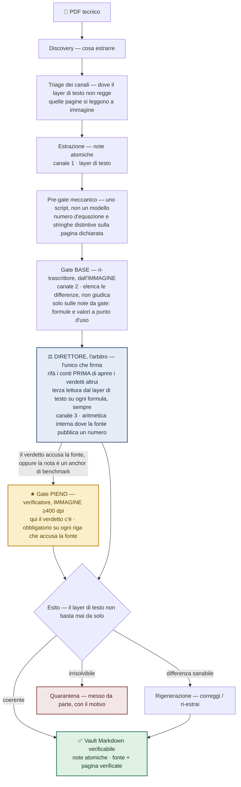

# Architettura — panoramica

florilegium trasforma raccolte di PDF tecnici in una knowledge base Markdown
**verificabile**. Non è un singolo prompt che "legge il PDF e scrive le note": è una
**pipeline a fasi**, dove ogni fase è una funzione con un unico compito, e la qualità
è garantita da **controlli indipendenti** invece che dalla fiducia in un solo passaggio.

Tre principi organizzano tutta l'architettura:

- **Verifica di terza parte (terzietà).** La funzione che *giudica* un contenuto non è la
  stessa che lo ha *prodotto*, e non vede il suo ragionamento: solo il suo output. Così
  un errore non può auto-confermarsi. → dettaglio in [roles](roles.it.md).
- **Gate a due livelli, più un arbitro.** Un controllo base gira sulle note che portano
  formule o valori; il controllo pieno e costoso scatta solo quando un verdetto accusa la
  fonte, o la nota è un anchor. Le discrepanze non salgono al controllo costoso: vanno
  all'**arbitro**, l'unico che firma. → dettaglio in [quality-gates](quality-gates.it.md).
- **Tre canali, non due.** Due letture che concordano possono essere lo stesso errore due
  volte, perciò il controllo usa anche un canale che non legge affatto: l'aritmetica
  interna alla fonte. La terza lettura la fa l'arbitro, su ogni formula, anche quando il
  gate non ha trovato niente. → dettaglio in [quality-gates](quality-gates.it.md).

## Le fasi

| Fase | Cosa fa | In breve |
|---|---|---|
| **Discovery** | Decide cosa estrarre e in che ordine | La coda di lavoro |
| **Triage dei canali** | Prima di estrarre, controlla su quali pagine il layer di testo regge davvero | Dove non regge, quella pagina si legge a immagine |
| **Estrazione** | Produce note atomiche dal layer di testo | Una nota = un concetto/formula |
| **Pre-gate meccanico** | Uno script verifica che numero d'equazione e stringhe distintive stiano sulla pagina dichiarata | Prende gli errori di pagina e di offset, a costo zero |
| **Gate di qualità e arbitro** | Base sulle note da gate; pieno solo su accusa alla fonte o anchor; l'arbitro rifà i conti, fa la terza lettura e firma | Il cuore metodologico |
| **Rigenerazione** | Corregge o ri-estrae ciò che i gate hanno segnalato | Il ciclo di correzione |
| **Vault verificabile** | Note Markdown con fonte + pagina verificate, collegate da `[[wikilink]]` | L'output |

## La feature-eroe

Sulle **formule**, la ri-lettura non parte mai dal testo OCR ma dall'**immagine** della
pagina: la formula viene ri-trascritta in modo indipendente e confrontata in modo
incrociato; e dove si accusa la fonte si sale a **≥400 dpi**. È lì che l'OCR sbaglia di
più, in modo silenzioso. Motivazione e dati
nell'[ADR-0001](decisions/0001-formula-verification-from-image.it.md).

## Perché a fasi (e non un prompt solo)

Un singolo prompt ha **una sola lettura** della pagina e nessuna seconda sorgente che la
contraddica. La separazione in funzioni indipendenti è ciò che rende possibile la
verifica: letture da sorgenti diverse (testo vs. immagine), da funzioni che non si vedono,
più un canale che non legge affatto — l'aritmetica interna alla fonte. Il costo — più
token, più passaggi — è il compromesso dichiarato del progetto:
*knowledge quality over token efficiency*.

## Documenti collegati

- [roles](roles.it.md) — le funzioni della pipeline e le loro responsabilità.
- [quality-gates](quality-gates.it.md) — i gate a due livelli, in dettaglio.
- [ADR-0001](decisions/0001-formula-verification-from-image.it.md) — verifica delle
  formule dall'immagine.
- [ADR-0002](decisions/0002-verdict-as-source-of-error.it.md) — il verdetto obbligatorio
  come sorgente di errore.
- [ADR-0003](decisions/0003-model-selection.it.md) — un modello per funzione.
- [ADR-0004](decisions/0004-chain-vs-single-prompt.it.md) — catena multi-agente vs
  singolo prompt.
- [ADR-0005](decisions/0005-cost-is-intrinsic-to-quality.it.md) — il costo intrinseco
  alla qualità (ottimizzazione respinta).
- [ADR-0006](decisions/0006-reader-must-not-know-the-expected-answer.it.md) — chi
  rilegge la fonte non deve conoscere la risposta attesa.
- [journal](../journal/README.it.md) — gli episodi da cui nascono queste decisioni.
