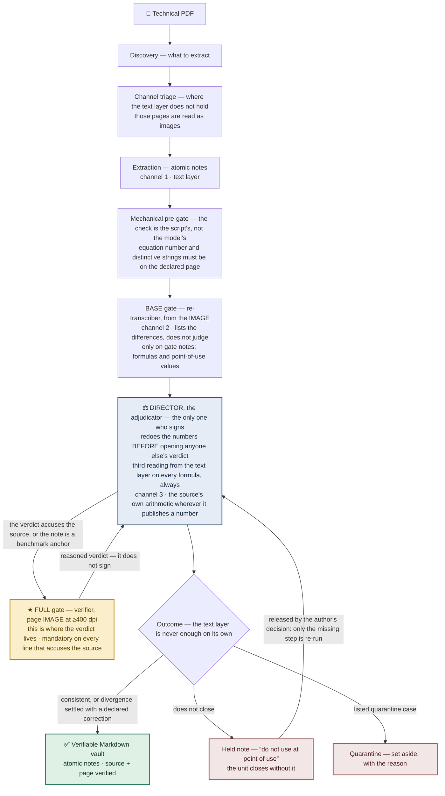

# Architecture — overview

florilegium turns collections of technical PDFs into a **verifiable** Markdown knowledge
base. It is not a single prompt that “reads the PDF and writes the notes”: it is a
**staged pipeline**, where each stage is a role with a single responsibility, and quality
is guaranteed by **independent checks** rather than trust in one pass.

Three principles organize the whole architecture:

- **Third-party verification.** The role that *judges* a piece of content is not the same
  one that *produced* it, and does not see its reasoning — only its output. This way an
  error cannot confirm itself. → detail in [roles](roles.md).
- **Two gate levels, plus an adjudicator.** A base check runs on the notes that carry
  formulas or values; the full, expensive check fires only when a verdict accuses the
  source, or the note is a benchmark anchor. Discrepancies do not escalate to the
  expensive check: they go to the **adjudicator**, the only one who signs. → detail in
  [quality-gates](quality-gates.md).
- **Three channels, not two.** Two readings that agree may be the same error twice, so the
  check also uses a channel that does not read at all: the source's own arithmetic. The
  third reading is performed by the adjudicator, on every formula, even when the gate found
  nothing. → detail in [quality-gates](quality-gates.md).

## The stages

| Stage | What it does | In short |
|---|---|---|
| **Discovery** | Decides what to extract and in what order | The work queue |
| **Channel triage** | Before extracting, checks on which pages the text layer actually holds | Where it does not, that page is read as an image |
| **Extraction** | Produces atomic notes from the text layer | One note = one concept/formula |
| **Mechanical pre-gate** | A script checks that the equation number and the distinctive strings are on the declared page | Catches page and offset errors; the outcome is the script's, not a model's |
| **Quality gates and adjudicator** | Base on gate notes; full only on accusations against the source or anchors; the adjudicator redoes the numbers, performs the third reading and signs | The methodological core |
| **Outcome, note by note** | Certifies; or **holds** the note, marked “do not use at point of use”; or quarantines it | No doubtful note enters the vault: the unit closes without it |
| **Verifiable vault** | Markdown notes with verified source + page, linked by `[[wikilinks]]` | The output |

## The hero feature

On **formulas**, the re-reading never starts from the OCR text but from the **image** of
the page: the formula is re-transcribed independently and cross-checked; and wherever the
source is accused, it goes to **≥400 dpi**. That is where OCR errs the most, silently. Rationale and data in
[ADR-0001](decisions/0001-formula-verification-from-image.md).

## Why staged (and not one prompt)

A single prompt has **one reading** of the page and no second source to contradict it.
Splitting into independent roles is what makes verification possible: readings from
different sources (text vs. image), by roles that do not see each other, plus a channel
that does not read at all — the source's own arithmetic. The cost — more
tokens, more passes — is the project’s stated trade-off: *knowledge quality over token
efficiency*.

## Related documents

- [roles](roles.md) — the pipeline roles and their responsibilities.
- [quality-gates](quality-gates.md) — the two-level gates, in detail.
- [ADR-0001](decisions/0001-formula-verification-from-image.md) — formula verification from
  the image.
- [ADR-0002](decisions/0002-verdict-as-source-of-error.md) — the mandatory verdict as a
  source of error.
- [ADR-0003](decisions/0003-model-selection.md) — one model per role.
- [ADR-0004](decisions/0004-chain-vs-single-prompt.md) — multi-agent chain vs single
  prompt.
- [ADR-0005](decisions/0005-cost-is-intrinsic-to-quality.md) — cost is intrinsic to
  quality (a rejected optimization).
- [ADR-0006](decisions/0006-reader-must-not-know-the-expected-answer.md) — whoever
  re-reads the source must not know the expected answer.
- [ADR-0007](decisions/0007-run-limits-are-shutdowns.md) — run limits are shutdowns, not
  quotas.
- [journal](../journal/README.md) — the episodes behind these decisions.
